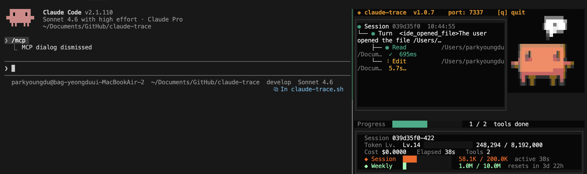

# claude-trace

> See every tool call Claude Code makes — live, in your terminal!

Claude Code shows a spinner while it works. **claude-trace** splits your terminal and renders a real-time tree of every tool call, progress bar, token usage, and an animated pixel-art companion.



---

## Features

- **Live tool tree** — Every `Read`, `Edit`, `Bash`, and subagent call rendered as a tree in real time
- **Status icons** — `◉` success · `⠸` running · `✗` failed · `⊘` denied · `◎` pending · `▣` subagent
- **Progress bar** — Completed tools out of total, updated as each tool finishes
- **Stats footer** — Token level bar, session context window, weekly usage with reset timer, cost, and elapsed time
- **Pixel-art sprite** — Animated character with 5 states and 4 emotions driven by live tool activity ([notchi](https://github.com/sk-ruban/notchi), MIT)
- **Auto-update** — Checks npm for a newer version on startup; press `y` to update in place
- **Non-invasive** — Uses Claude Code's official HTTP hook system; no source modification required
- **Auto-restore** — `.claude/settings.json` is restored to its original state on exit

---

## Requirements

- Node.js >= 18
- tmux
- [Claude Code CLI](https://claude.ai/code)
- macOS or Linux

---

## Installation

**npm (recommended):**
```bash
npm install -g claude-trace
```

**From source:**
```bash
git clone https://github.com/ydking0911/claude-trace.git
cd claude-trace
npm install && npm run build && npm link
```

---

## Usage

Use `claude-trace` anywhere you would use `claude`:

```bash
claude-trace "read the codebase and fix the bug in auth.ts"
claude-trace --model claude-opus-4-6 "refactor the payment module"
```

When launched, tmux automatically splits your terminal:
- **Left (60%)** — Claude Code running normally
- **Right (40%)** — claude-trace TUI

**Optional alias** — use `claude` as usual with tracing always on:
```bash
echo "alias claude='claude-trace'" >> ~/.zshrc && source ~/.zshrc
```

---

## How It Works

```
claude-trace "prompt"
      │
      ├─ Temporarily injects HTTP hooks into .claude/settings.json
      ├─ Creates a tmux session (60/40 split)
      │       ├─ Left pane:  claude <args>
      │       └─ Right pane: TUI server (localhost:7337)
      │
While Claude Code runs:
      ├─ UserPromptSubmit    → POST /event → creates TurnNode, reads transcript tokens
      ├─ PreToolUse          → POST /event → adds ToolNode (running)
      ├─ PostToolUse         → POST /event → marks ToolNode (success), reads transcript tokens
      ├─ PostToolUseFailure  → POST /event → marks ToolNode (failed)
      ├─ PermissionRequest   → POST /event → marks ToolNode (pending)
      ├─ PermissionDenied    → POST /event → marks ToolNode (denied)
      ├─ SubagentStart       → POST /event → creates AgentNode
      ├─ SubagentStop        → POST /event → marks AgentNode complete
      └─ SessionEnd          → POST /event → waits 5s, restores settings, exits
```

All hooks use `async: true` so the TUI server's response time never blocks Claude Code.

---

## Keyboard Shortcuts

By default, focus stays on the left (Claude) pane. To use TUI controls, switch to the right pane first:

```
Ctrl+B → →   (tmux: move focus to right pane)
Ctrl+B → ←   (tmux: move focus back to left pane)
```

Once the right pane is focused:

| Key | Action |
|-----|--------|
| `q` / `Ctrl+C` | Exit TUI |
| `↑` / `↓` / `j` / `k` | Scroll the tool tree |
| `y` | Install available update (shown in header when a newer version is found) |

**Mouse pane resize:** Drag the pane divider to resize. Only works in terminals that support tmux mouse mode (e.g. iTerm2). Ghostty, Warp, and similar terminals may not support this.

**Pane resize without mouse** — works in all terminals:
- tmux command: `Ctrl+B` then `:resize-pane -R 10` (expand right pane) / `-L 10` (shrink)
- Fixed split: set `CLAUDE_TRACE_SPLIT=50` (default: `40`) before launching

**Mouse scroll:** Scroll wheel inside the tool tree works without switching pane focus.

---

## Node Status Icons

```
◉  success  — green,  tool completed
⠸  running  — amber spinner, in progress
◎  pending  — gray,   awaiting permission
✗  failed   — red,    tool error
⊘  denied   — orange, permission denied
▣  agent    — blue,   subagent
```

---

## Sprite States

The pixel-art companion in the top-right corner reflects the current activity:

| State | Trigger |
|-------|---------|
| `working` | One or more tools are currently running |
| `waiting` | Claude is generating a response (between prompt and first tool call) |
| `compacting` | A context compaction tool is running |
| `sleeping` | No session, or 60+ seconds without any hook event |
| `idle` | Session active, no tools running |

Emotion follows tool outcomes: `happy` after 5+ successful completions, `sad` on any failure, `neutral` otherwise. After all tools finish, the sprite briefly holds the outcome emotion before returning to idle.

---

## Stats Footer

The footer displays five rows of live metrics:

| Row | Content |
|-----|---------|
| Session | Truncated session ID |
| Token Lv. | Exponential level bar — Lv.1: 0–1K tokens, Lv.2: 1K–3K, doubles each level |
| Cost / Elapsed / Tools | Estimated cost, session duration, total tool count |
| ◆ Session | Context window usage (orange) — input + cache tokens vs. 200K limit |
| ◆ Weekly | Weekly output token usage (green) vs. 10M limit, with reset countdown |

Token counts are read directly from Claude Code's own `.jsonl` transcript files in `~/.claude/projects/`.

---

## Environment Variables

| Variable | Default | Description |
|----------|---------|-------------|
| `CLAUDE_TRACE_PORT` | `7337` | Event server port (auto-increments on conflict) |
| `CLAUDE_TRACE_PROJECT_DIR` | `cwd` | Directory used to locate `.claude/settings.json` |
| `CLAUDE_TRACE_SPLIT` | `40` | Right pane width as a percentage (e.g. `50` for an even split) |

---

## Sprite Credits

The pixel-art character in the top-right corner is converted from [notchi](https://github.com/sk-ruban/notchi) sprites (MIT License, by [sk-ruban](https://github.com/sk-ruban)) into ANSI half-block characters via [chafa](https://hpjansson.org/chafa/).

To regenerate sprites after updating notchi:
```bash
brew install chafa imagemagick
bash scripts/generate-sprites.sh
npm run build
```

---

## Contributing

See [CONTRIBUTING.md](CONTRIBUTING.md).

---

## License

MIT © [ydking0911](https://github.com/ydking0911)
